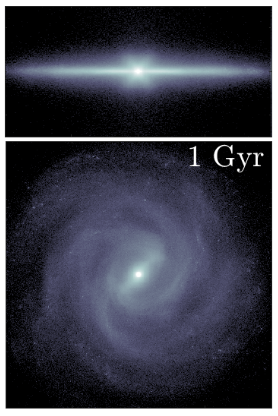

## About

I am a research fellow at the Sydney Institute for Astronomy in the University of Sydney.

I am a native speaker of English but also have a relatively high Japanese language proficiency - I did my PhD (published in English) at the Univeristy of Hokkaido in Sapporo, Japan.  

* * *

## Astronomy Research

I like to reseach barred-spiral galaxies and the stars in them. I personally develop N-body numerical simulations of (resolved) galaxies to study stellar populations and kinematics.

I am also a member of the <a href="https://www.galah-survey.org">GALAH</a> and <a href="https://geckos-survey.org">GECKOS</a> survey collaboration teams.  

You can find out about my publications [here](./reference-list.html).

* * *

## Outreach

I am regularly invloved in science outreach activities, such as public talks, telescope tours and school visits. I think it is important to inspire young people of all genders and socio-economic background to study science if it interests them!

* * *

## Science Education & Pedagogy

I am interested in understanding the way people 'learn' to *do science*. I don't believe this is an innate skill and, therefore, must be able to be developed. 
How can we (as scientists) facilitate others to develop these skills?  

* * *

### Contact
e-mail: elizabeth.iles [at] sydney.edu.au

