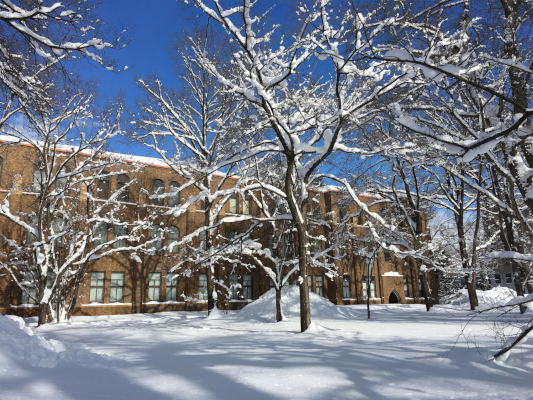

## About

I am a Research Associate in Galactic Archaeology at the Sydney Institute for Astronomy in the University of Sydney. I am also a Visiting Fellow at the University of New South Wales. 

I am a native speaker of English but I am also conversationally fluent in Japanese - I did my PhD (published in English) at the Univeristy of Hokkaido in Sapporo, Japan.  

| | |
|The University of Hokkaido museum building in winter,| Walking up stairs in Kyoto on my |
| covered in snow. | graduation trip. |

* * *

## Astronomy Research

I like to research barred-spiral galaxies and how these beautiful structures impact the conditions within them - everything from star formation rates, stellar motion & kinematics, chemical mixing, gas streaming and outflows, to the large- and small-scale structure of inter-stellar medium (ISM). 

I personally develop N-body numerical simulations specifically tailored to nearby (resolved) galaxies. You can find examples and details in the [GOANNA Simulations Project](./Goannas.html). You can also find out about my peer-reviewed publications [here](./reference-list.html). 

I am a member of the <a href="https://www.galah-survey.org">GALAH</a> (galactic archaeology) and <a href="https://gaskap.anu.edu.au">GASKAP</a> (HI and OH lines in the Milky Way and Magellanic Systems) collaboration teams, as well as co-chair of the Theory Working Group in the <a href="https://geckos-survey.org">GECKOS</a> (observations of edge-on galaxies) collaboration.

| |
| Mock composite observation-like images produced from two simulations (IsoB - left, TideB - right).| 
| IsoB is barred-spiral galaxy formed in isolation, while similar structure in TideB has been triggered |
|  by interaction with a dwarf galaxy-like companion. |

* * *

## Outreach

I am regularly invloved in science outreach activities, such as public talks, telescope tours and school visits. I am also available for mentoring on scientific research projects at all levels - I hold a valid Working with Children check in NSW and have previously mentored student projects from Yr 9-University levels. 

I believe it is important to inspire people of all genders, ages and socio-economic background to study science if it interests them!

Feel free to send an email via the [contact](###Contact) address if you are interested in any of these outreach opportunities, so that I may assist you in your goal to engage with science (or at least put you in touch with an organisation who can). 

* * *

## Science Education & Pedagogy

I am interested in understanding the way people 'learn' to *do science*. I don't believe this is an innate skill and, therefore, must be able to be developed. 
How can we (as scientists) facilitate others to develop these skills?  

* * *

### Contact
e-mail: elizabeth.iles [at] sydney.edu.au

